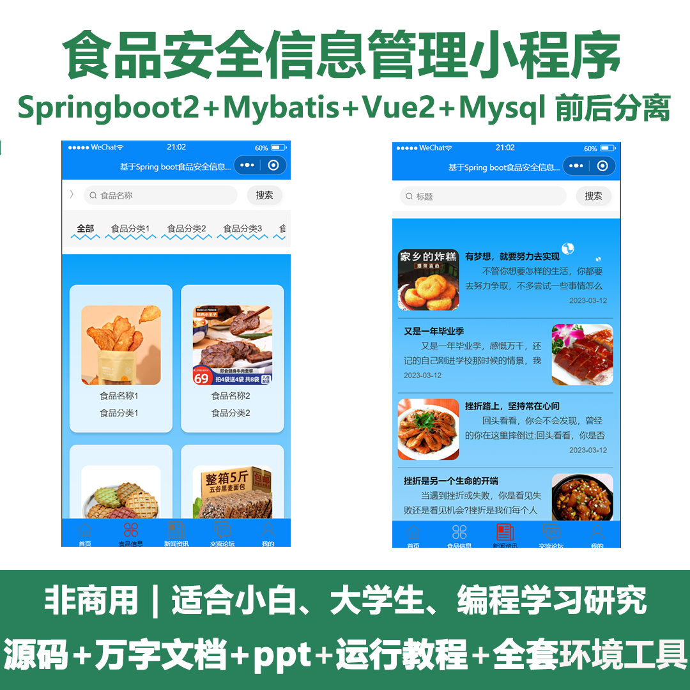
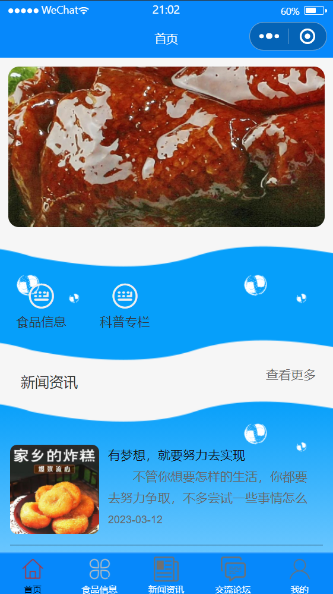
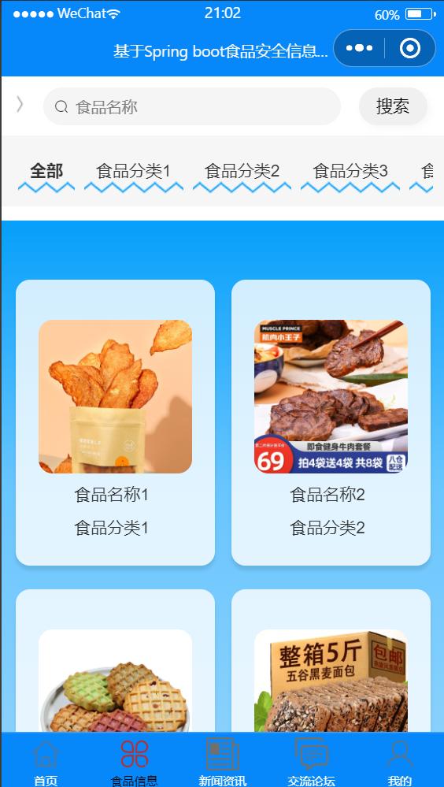
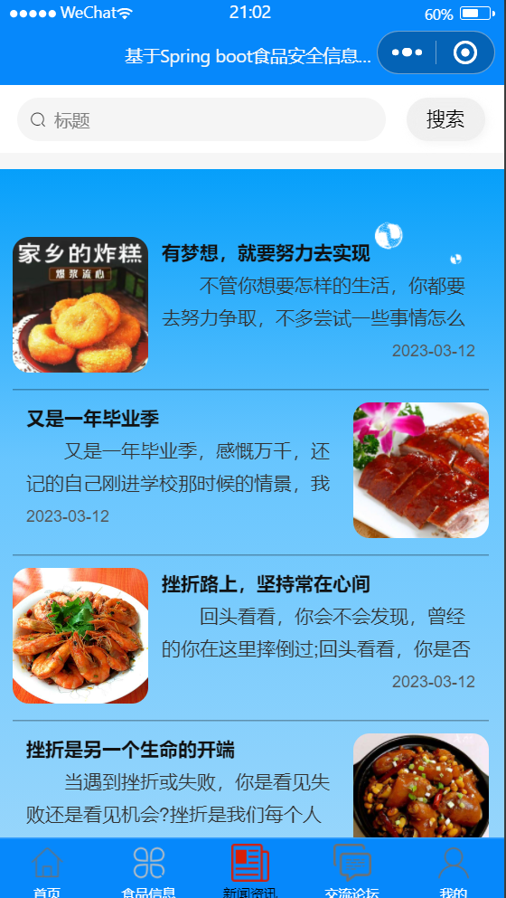
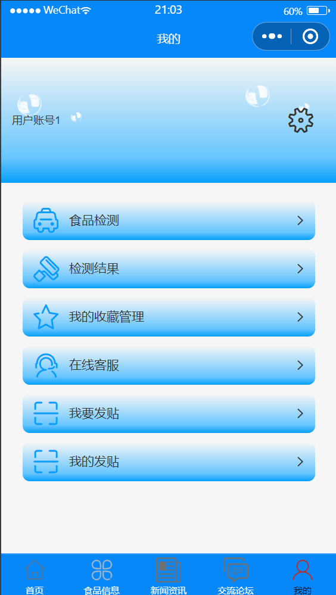
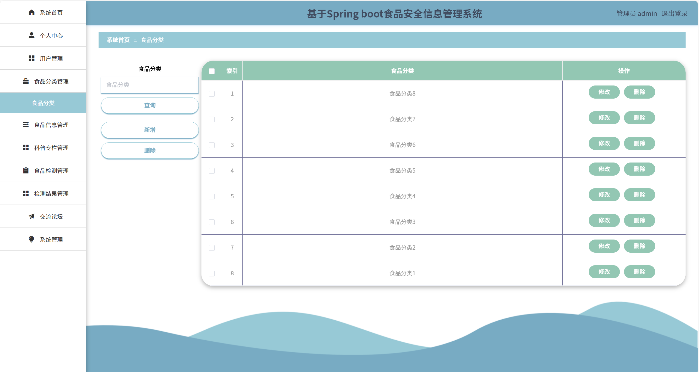
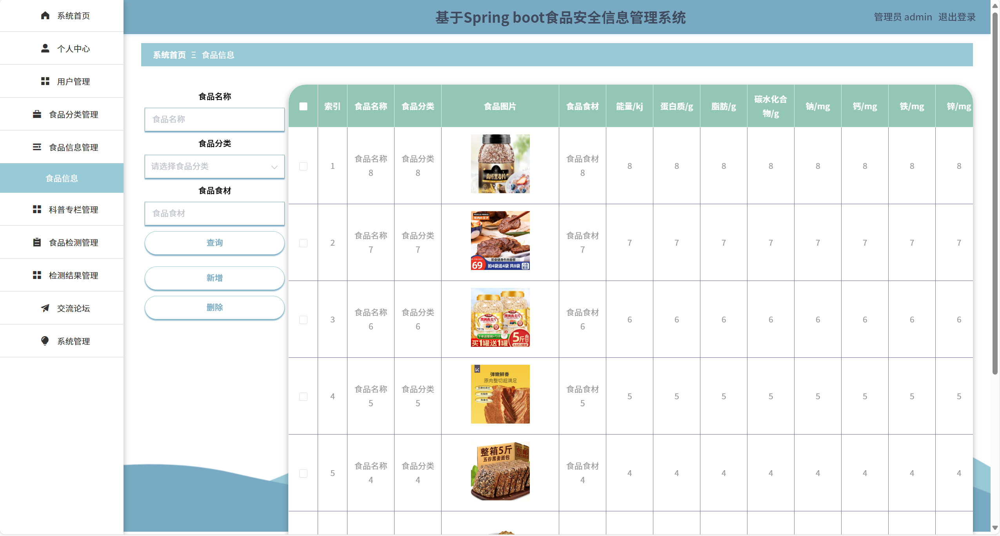
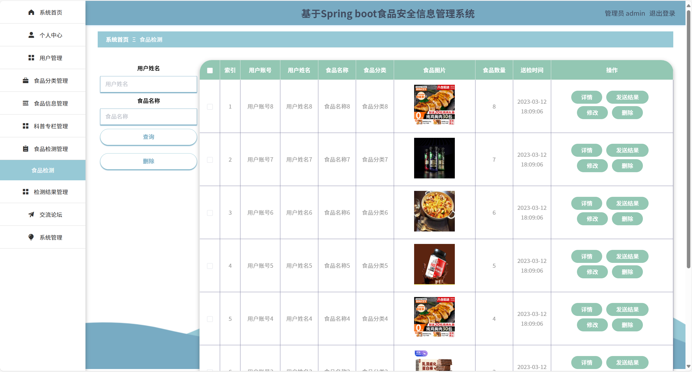
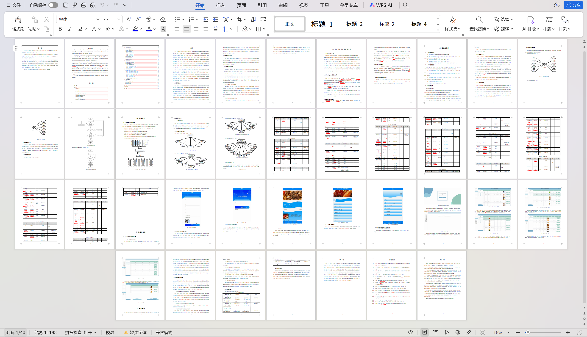

# mpweixinA083
mpweixinA083食品安全信息管理小程序+LW+PPT
 
## 查看主页获取源码

### 一、关键词
食品安全信息管控，食品信息管理，食品安全管理信息微信小程序

### 二、作品包含
源码+数据库+万字设计文档+PPT+全套环境和工具资源+本地部署教程

### 三、项目技术
前端技术： Html、Css、Js、Vue2.0、Element-ui、uniapp
后端技术：Java、SpringBoot2.0、MyBatis

### 四、运行环境（以下版本亲测，其他版本兼容性请自行测试）
开发工具：IDEA/eclipse  + VSCODE + 微信开发者工具 + HBuilder X

数据库：MySQL5.7

数据库管理工具：Navicat10以上版本

环境配置软件： JDK1.8 + Maven3.6.3

前端Nodejs：14

浏览器：谷歌浏览器

### 五、项目介绍
项目编号：mpweixinA083

食品安全信息管理系统设计的目的是为用户提供食品信息、科普专栏、食品检测、检测结果、交流论坛等方面的平台。
与PC端应用程序相比，食品安全信息管理系统的设计主要面向于用户，旨在为管理员和用户提供一个食品安全信息管理系统。用户可以通过APP及时查看食品信息、新闻资讯、交流论坛等。
食品安全信息管理系统是在安卓操作系统下的应用平台。为防止出现兼容性及稳定性问题，编辑器选择的是Hbuildex，安卓APP与后台服务端之间的数据存储主要通过MySQL。用户在使用应用时产生的数据通过 java等语言传递给数据库。通过此方式促进食品安全信息管理系统信息流动和数据传输效率，提供一个内容丰富、功能多样、易于操作的食品安全信息管理系统。
  

### 六、运行截图

